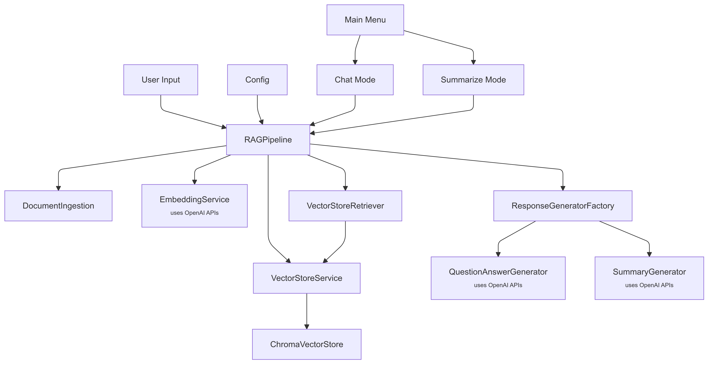

# RAG Console Chat Application: Better Information Retrieval and Generation



## Overview

Welcome to the RAG Console Chat Application, a simple yet powerful tool designed to transform the way you interact with and extract information from vast document repositories. This project implements document ingestion, embedding generation, and retrieval-augmented generation (RAG). If you are looking to chat with your data or summarize complex topics, the RAG Console Chat Application is your go-to tool for intelligent information processing.

## Technologies Used

- **Python**: The backbone of our application, providing a robust and flexible programming environment.
- **OpenAI API**: Utilized for generating embeddings and responses, ensuring high-quality and contextually relevant outputs.
- **ChromaDB**: A powerful vector database that stores and retrieves document embeddings efficiently.
- **Rich & Questionary**: Libraries for creating interactive and visually appealing command-line interfaces.

## Concepts and Components

### Retrieval-Augmented Generation (RAG)

RAG is a novel approach that combines the strengths of information retrieval and natural language generation. It enhances the quality of generated responses by incorporating relevant context from a large corpus of documents. The RAG Pipeline implements this by:

1. **Document Ingestion**: Loading and processing documents from various formats (TXT, PDF, DOCX).
2. **Embedding Generation**: Using OpenAI's models to convert text into high-dimensional vectors that capture semantic meaning.
3. **Vector Store**: Storing these embeddings in ChromaDB, allowing for efficient similarity searches.
4. **Response Generation**: Utilizing retrieved document chunks to generate accurate and context-aware responses.

### Vector Database

A vector database like ChromaDB is essential for storing and querying embeddings. It allows for fast retrieval of similar documents based on vector similarity, which is crucial for the RAG process.

### Embeddings

Embeddings are numerical representations of text that capture semantic information. They enable the comparison of text data in a meaningful way, facilitating tasks like document similarity and clustering.

## Features

- **Interactive Chat Mode**: Engage in a conversational interface to ask questions and receive answers based on your document corpus.
- **Summarization Mode**: Generate concise summaries of topics using the most relevant document chunks.
- **Document Processing**: Automatically ingest and process documents, splitting them into manageable chunks for efficient storage and retrieval.
- **Embeddings Management**: Generate and store embeddings for new documents, ensuring your vector store is always up-to-date.
- **Cross-Platform Support**: Seamlessly run the application on Windows, macOS, and Linux.
- **Better Coding Practices**: Utilizes OOPs concepts and design patterns like Singleton & Factory along with other best practices.
- **Logging**: Uses logging to keep track of the application's activities at different levels.
- **Rich & Questionary**: Libraries for creating interactive and visually appealing command-line interfaces.

## Setup Instructions

To set up the RAG Pipeline on your local machine, follow these steps:

1. **Install Python 3.10+**:
   Download and install from [here](https://www.python.org/downloads/)

2. **Install Microsoft Visual Studio C++ Build Tools**:
   This is necessary for compiling some of the dependencies. Download and install from [here](https://visualstudio.microsoft.com/visual-cpp-build-tools/).

3. **Clone the Repository**:

   ```bash
   git clone https://github.com/olifarhaan/rag-console-chat.git
   cd rag-console-chat
   ```

4. **Install Python Dependencies**:
   Ensure you have Python 3.8+ installed. Then, create a virtual environment and install the required packages:

   ```bash
   python -m venv venv
   source venv/bin/activate  # On Windows, use `venv\Scripts\activate`
   pip install -r requirements.txt
   ```

5. **Set Up Environment Variables**:
   Create a `.env` file in the root directory and add your OpenAI API key:

   ```
   OPENAI_API_KEY=your_openai_api_key
   ```

6. **Run the Application**:
   Start the RAG Pipeline by executing:

   ```bash
   python app.py
   ```

7. **Interact with the Application**:
   Use the command-line interface to choose between chat and summarization modes, and explore the capabilities of the RAG Pipeline.

## Conclusion

The RAG Console Chat Application is a simple yet powerful tool designed to enhance your document processing and information retrieval capabilities. With its advanced features and user-friendly interface, it stands as a testament to the power of modern AI technologies. Dive into the world of RAG and experience the future of intelligent information systems today.

- **Licensing**: This project is licensed under the [MIT License](https://opensource.org/licenses/MIT). You are free to use, modify, and distribute the software, provided that the original license and copyright notice are included in all copies or substantial portions of the software.

- **Diagram**: The diagram was created using [Mermaid](https://mermaid.js.org/).

- **Contact**: For any questions or feedback, please contact [olifarhaan@gmail.com](mailto:olifarhaan@gmail.com) or message me on LinkedIn [@olifarhaan](https://www.linkedin.com/in/olifarhaan/).
